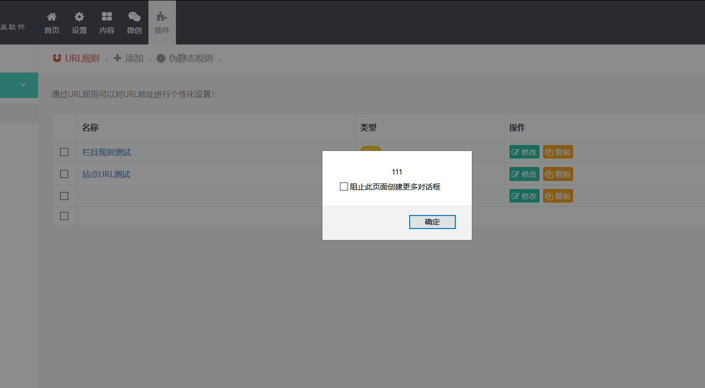
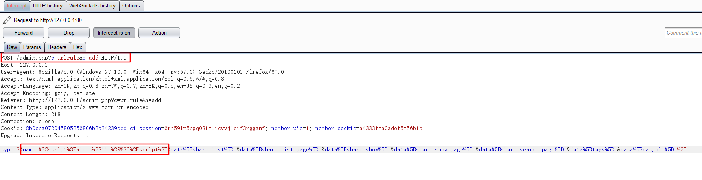
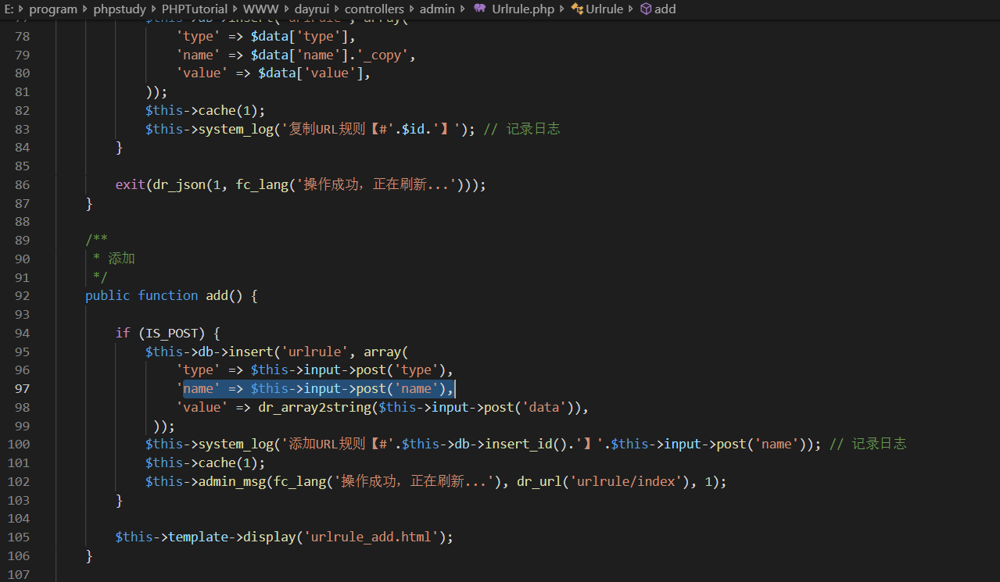

# finecms xss漏洞

这里的软件版本是 finecms v5.4.0

在插件模块存在一个xss漏洞，访问url为本地环境的127.0.0.1/admin.php

点击添加，插入一个url规则，里面写入xss的payload

保存后访问插件页面，出现了xss的弹窗

然后进行一下问题在代码中的定位

在点击添加按钮时抓包

访问的是admin中的urlrule的add，对应的是dayrui/controllers/admin下的urlrule.php文件

对应的add函数

发现这里没有对post中获取到的name进行过滤就直接插入数据库中了导致了xss的问题