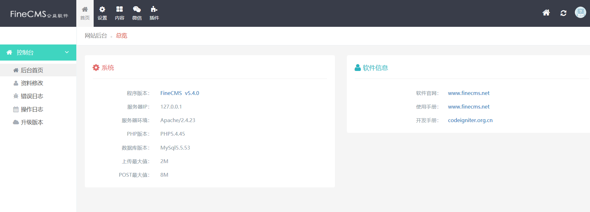
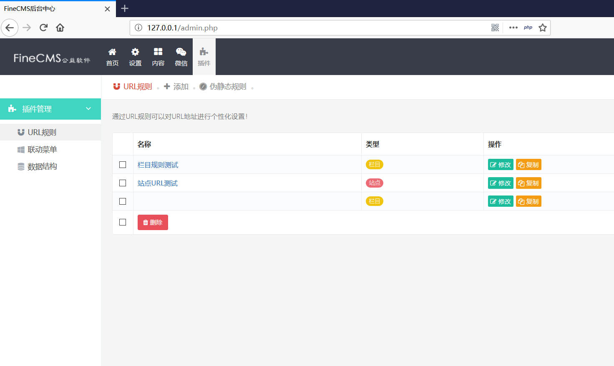
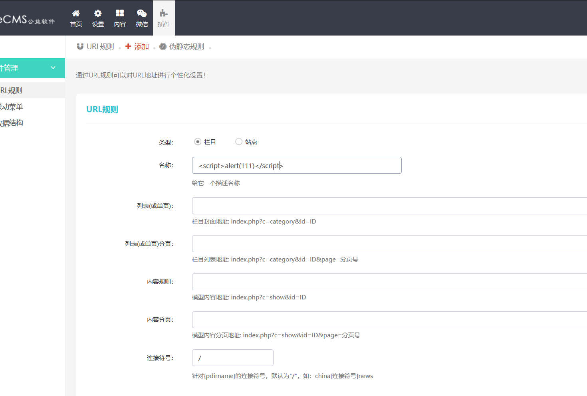
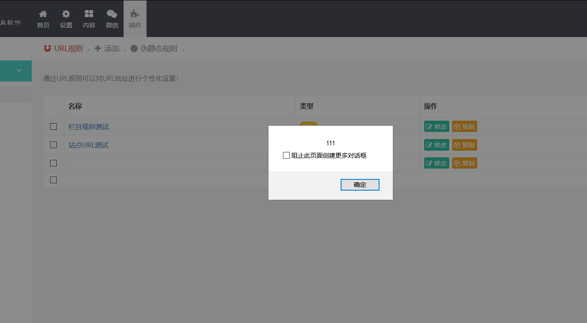
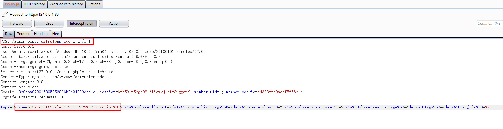
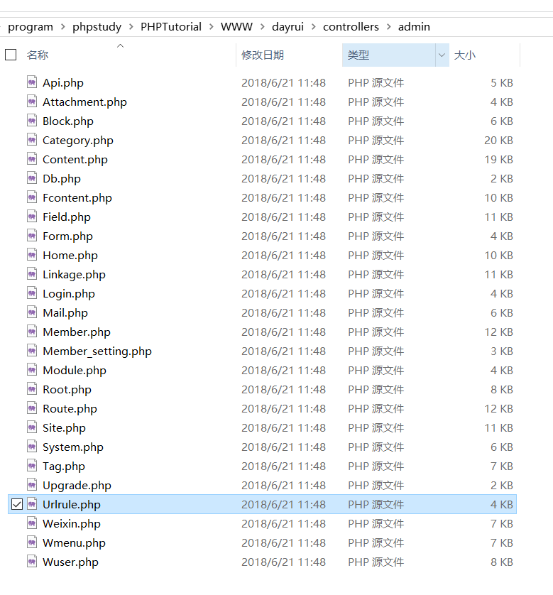
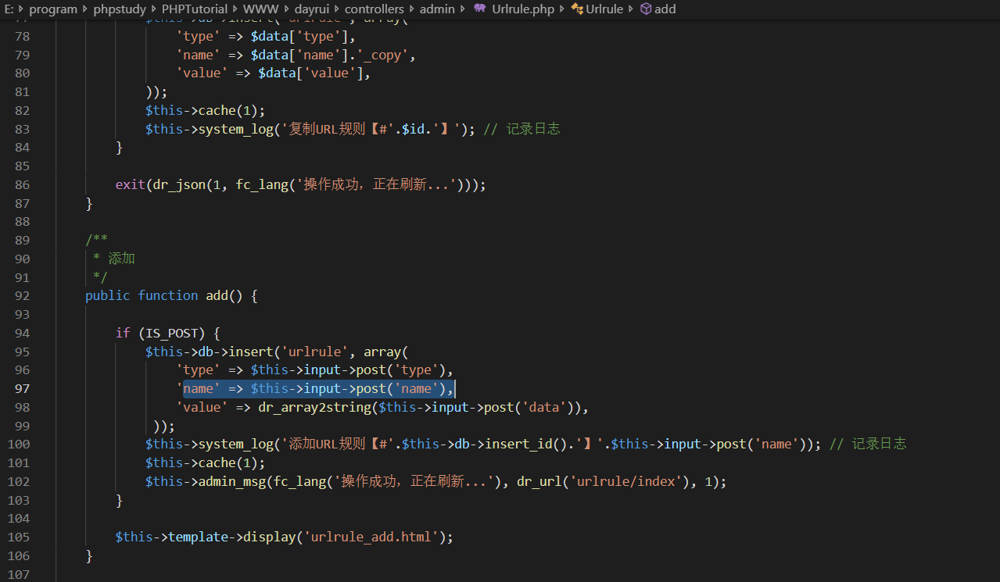

# finecms xss vulnerability

The vesion of program is finecms v5.4.0

There is a XSS in plugin module，my local url is '127.0.0.1/admin.php'

click the '添加' button，insert an url rule and the name is ''

Save and access the plugin page.The XSS alert appears.

And then I will find the program location in the code.

I capture the package when I click the '添加' button in burpsuite.

In url we can find admin.php and `c=urlrule m=add`，in directory is dayrui/controllers/admin/urlrule.php

in this file we can find the add() function

So it's clearly that there is not filter when getting the post data 'name'.And insert a unsafe 'name' in database
